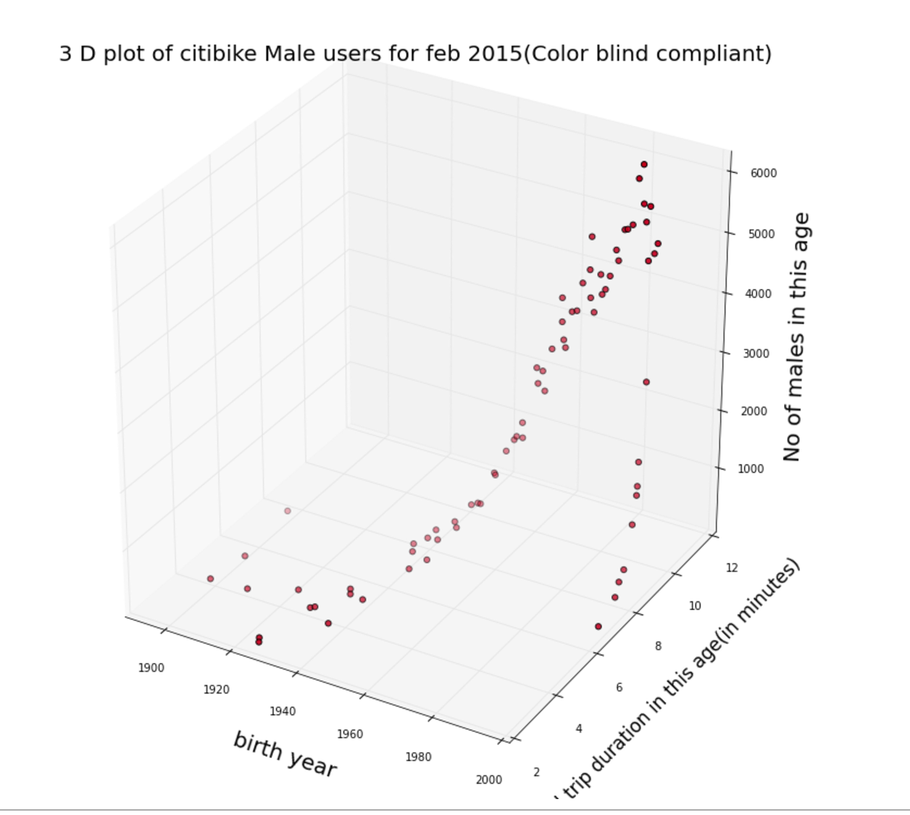

**********
PLOT REVIEW FOR wh937
**********

CLARITY: Title is clear, good notation of the date of the data. The use of "...males in this age" for 2 of the axes is awkward. Better to say "# of males per birth year" and "avg.(?) trip duration per birth year (minutes)," which is both more precise language and uses 'birth year' as consistent with your other axis. 3D complicates this, more on that below. 

AESTHETIC: Using 3D introduces a lot of complexity and distracts from a clear perception of the data here. Also - this may have been my fault, but it looks like a bit of the bottom was cut off: was "average" cut off of "...trip duration in this age (minutes)"? That's a key description of the data, so make sure it's in the label.

HONESTY: Again, 3D not only makes this a more difficult to read, more importantly it can distort the data. For example, it's not clear if there is an upward trend in number of males as birth year increases (i.e. more young males) or if its an upward trend in avg. length of trips as birth year increases...or both, and if so, to what extent is the trend in each variable.

SUGGESTIONS: Rather than use 3D, perhaps it would have been better to plot avg trip duration vs birth year in a 2D plot (x-axis = birth year, y-axis = trip duration), and used point size or color gradient as a visualization of the third variable, number of males per birth year.
