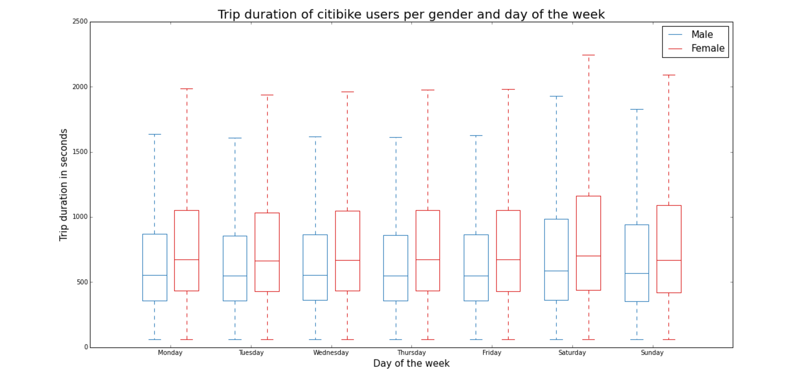

*********
PLOT REVIEW FOR dm3085
*********

CLARITY: It's easy to understand at a glance what is being plotted. Semantically, might suggest to use more distinctive adverbs in title to more explicitly call out the variables, such as: "Trip duration vs day of the week, by gender". 

AESTHETIC: Clear and clean. Not too complicated. Given the repetitive nature of the data across 7 days, the lines can be a bit fatiguing. Maybe use more sharply contrasted colors. X and Y labels could be a bigger font.

HONESTY: Pretty direct, doesnt seem like there's any distortion. It's hard to say without seeing the data, but it's likely there are a few statistical outliers in the data, which in a box and whisker plot would be represented as dots above and below the whiskers and not represented by the box/whiskers themselves.

SUGGESTIONS:  There is not a lot of variance in terms of mean and quartile thresholds for each day and gender, so it's difficult to see if there's any data that is important here. If not too cluttered, maybe an overall mean plotted as a single line across the graph would give more context.
